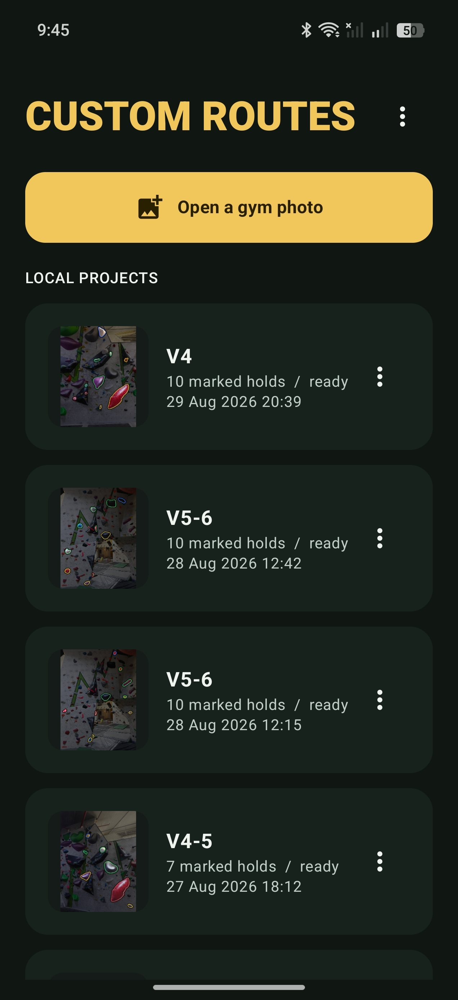
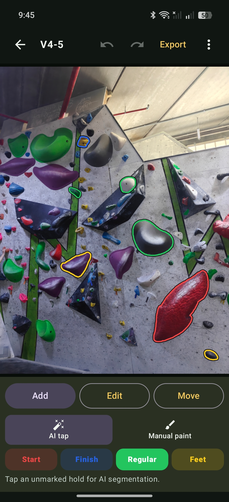
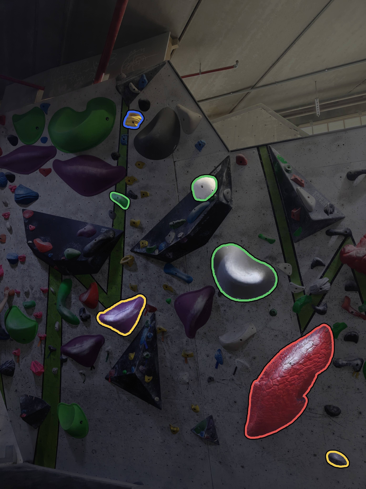

# Custom Routes

Create and share custom climbing routes from a gym photo.

Custom Routes is an Android app for marking the holds in a route, assigning
their roles, and exporting a clean image to share. Projects and photos stay on
your device, and no account is required.

## Screenshots

<p align="center">
  
  
  
</p>

## What You Can Do

- Open a photo with Android's system photo picker.
- Mark individual holds with optional AI assistance or paint them manually.
- Assign start, finish, regular, and feet-only roles.
- Refine outlines with include, exclude, paint, and erase tools.
- Pan, zoom, undo, and redo while editing.
- Save editable projects locally and return to them later.
- Preview and export a full-resolution JPEG with high-contrast hold outlines.

The app does not automatically discover every climbing hold. You choose the
holds that belong to your route, which keeps the result under your control.

## Requirements

- Android 12 or newer
- An ARM64 Android device for release builds
- Portrait orientation

## Optional AI Assistance

Manual marking works without an AI model. When you first select an AI tool, the
app asks before downloading approximately 40 MB of EfficientSAM-Ti model files
from the project's Hugging Face Space. The files are published under the
Space's Apache-2.0 repository license and are verified by size and SHA-256 hash
before use.

AI inference runs locally on the device. Downloaded model files can be removed
from the app's Privacy & Data settings.

## Privacy

Photos, projects, masks, preferences, and AI inference remain on the device.
The app has no analytics, advertising, account system, or backend service. Its
only network operation is a model download that you explicitly approve.

JPEGs become public media only when you choose to save them. Other gallery or
cloud-photo apps may then process or synchronize those exported files. See
`PRIVACY.md` for the complete policy.

## Building

The project requires JDK 17 and Android SDK 36. Build and run the tests with the
project Gradle wrapper:

```sh
./gradlew testDebugUnitTest assembleDebug
```

The debug APK is written to `app/build/outputs/apk/debug/app-debug.apk`.

## License

Custom Routes is free software licensed under the GNU General Public License,
version 3 or later. See `LICENSE`.
